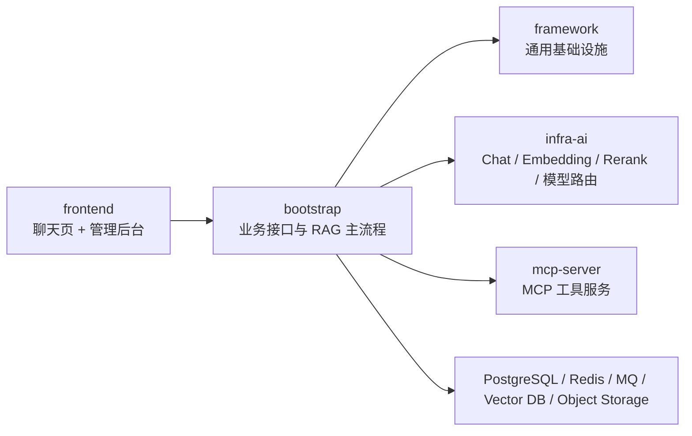
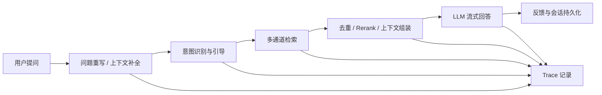
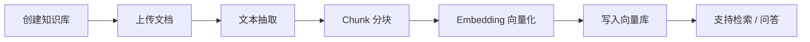

# 项目地图与讲述稿

## 一句话定位

`Ragent` 是一个基于 `Java 17 + Spring Boot + React` 的企业级 RAG 智能体平台，覆盖知识入库、智能问答、MCP 工具调用、模型路由容错和链路追踪等完整能力，不是只会调模型 API 的 Demo。

## 你先记住这 5 个词

- 知识库
- 入库流水线
- RAG 检索
- MCP 工具
- Trace 链路追踪

## 模块地图

## 你要能讲清楚的模块职责

- `bootstrap`
  负责主应用、Controller、Service、RAG 主链路、知识库管理、入库任务、Trace 查询等业务能力。
- `framework`
  负责通用能力，比如统一返回、异常处理、上下文、Trace 上下文透传等。
- `infra-ai`
  负责模型侧抽象，封装聊天模型、Embedding、Rerank、模型选择和故障降级。
- `mcp-server`
  负责 MCP 工具服务本身，是工具调用能力的独立服务入口。
- `frontend`
  负责聊天页与后台管理台，路由里能看到 `chat`、`knowledge`、`intent-tree`、`ingestion`、`traces`、`settings` 等页面。

## 关键入口

- 主应用：`RagentApplication`
- MCP 服务：`MCPServerApplication`
- 聊天接口：`GET /rag/v3/chat`
- 知识库接口：`/knowledge-base`
- 文档上传与分块：`/knowledge-base/{kb-id}/docs/upload`、`/knowledge-base/docs/{doc-id}/chunk`
- Trace 查询：`/rag/traces/runs`

## 项目整体链路

### 问答链路

### 知识入库链路

## 3 分钟项目介绍稿

你可以直接背下面这版，再逐渐替换成自己的表达：

> 我最近重点消化了一个叫 `Ragent` 的企业级 RAG 智能体项目。它不是单纯封装大模型 API，而是把企业知识问答真正会遇到的链路做完整了，包括文档入库、分块、向量化、意图识别、多路检索、Rerank、会话记忆、模型路由容错、MCP 工具调用和链路追踪。  
>  
> 技术上它是前后端分离架构，后端用 `Java 17 + Spring Boot`，前端是 `React`。后端按职责拆成 `bootstrap`、`framework`、`infra-ai` 和 `mcp-server` 四层。`bootstrap` 承接业务和接口，`infra-ai` 屏蔽不同模型供应商差异，`framework` 提供通用基础设施，`mcp-server` 提供工具服务能力。  
>  
> 我重点看了三个设计。第一是多通道检索，不是只做单路向量召回，而是把意图定向检索和全局向量检索并行执行，再做去重和 Rerank，兼顾准确率和兜底能力。第二是模型路由容错，项目会在多个候选模型之间按优先级选择，并在失败时自动降级，避免单一模型故障影响服务。第三是链路追踪，项目对重写、检索、生成这些环节都做了 Trace 采集，结合 TTL 透传上下文，方便在异步链路里定位问题。  
>  
> 对我来说，这个项目最大的价值不是学会一个框架，而是让我把 AI 应用里真正有工程含量的部分串起来了。我现在能把一条完整问答链路和一条文档入库链路讲清楚，也能结合源码解释为什么这样设计。

## 30 秒版

> `Ragent` 是一个企业级 RAG 智能体平台，我重点消化了它的知识入库、聊天问答、多路检索、模型容错和 Trace 追踪链路。它让我把 `Java Spring Boot` 后端工程和 `AI Agent/RAG` 场景结合起来，不只是会调模型，而是能讲清楚完整系统如何落地。

## 项目整体链路口述稿

> 用户进入聊天页后，通过 `RAGChatController` 发起 SSE 流式请求。后端会结合会话上下文做问题重写和意图识别，然后进入多通道检索。检索结果会经过去重和 Rerank，组装为最终上下文，再交给模型生成流式回答。整个过程中会记录 Trace。  
>  
> 如果是知识管理场景，管理员先创建知识库，再上传文档，系统完成文件存储、文本抽取、分块、Embedding 向量化和写入向量库，后续问答时就能被召回。

## 第一阶段自测

- 不看 README，能说出 5 个关键词
- 能讲清四个后端模块职责
- 能说清 `bootstrap` 和 `mcp-server` 的区别
- 能独立复述一条问答链路和一条入库链路

